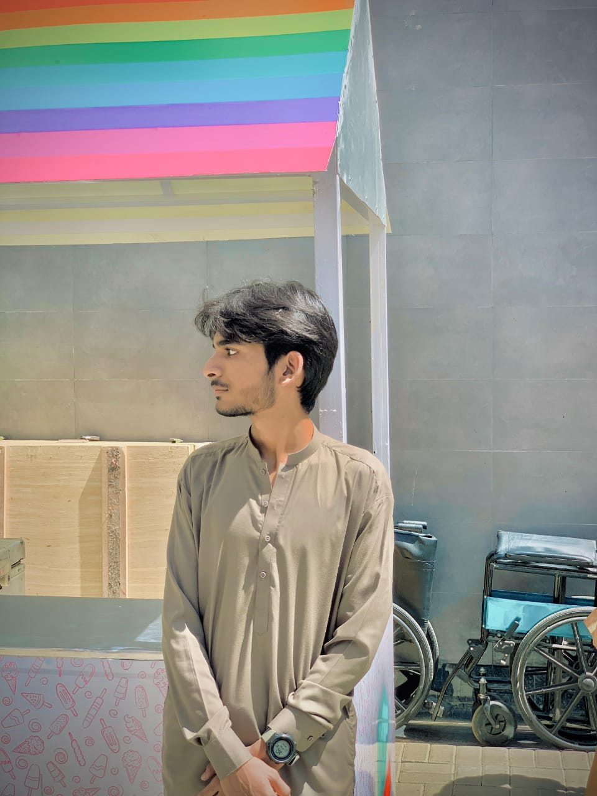

<!DOCTYPE html>
<html lang="en">
<head>
    <meta charset="UTF-8">
    <meta name="viewport" content="width=device-width, initial-scale=1.0">
    <title>MY PORTFOLOI</title>
    <link rel="stylesheet" href="./index.css">
</head>
    
<body style="background-color:rgba(218, 241, 12, 0.247)">

    

    

<ul type="none" >

<li><a href="">ABOUT</a></li>

<li><a href="">SKILLS</a></li>

<li><a href="">Experiance</a></li>

<li><a href="">Qualifications</a></li>

<li><button id="contact" style="font-size: x-large;"> <a href="https://wa.me/+923363361621" style="color: gold;" >Contact Me</a> </button></li>

</ul>

MUZZAMIL HABIB

 
 

 

    <h1><i>HI, My name is MUZZAMIL HABIB</i></h1>
    
i am 17 years old video editor i can edits your videos same as your all wishes 

    <button id="hi"><a href="https://wa.me/+923363361621" style="color: black;" >SAY HELLO!</a></button>
 

__________________________________________________________________________________________________

    <h1 style="font-size:50px;" >PORTFOLIO</h1>
    
Here,are my all social profiles

    

    
    

    
    

       

    

MADE BY

   

   

<i>MUZZAMIL HABIB</i>

   

Email:
<a href="https://muzzamilh868@gmail.com">muzzamilh868@gmail.com</a>

</body>
</html>
